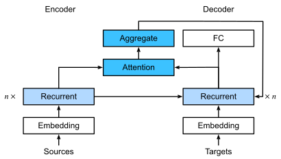
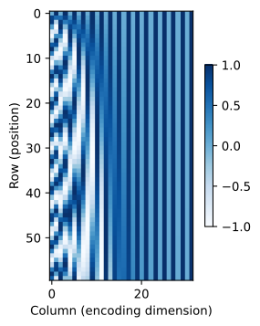

# Chapter 11 Summary

## 11.1. Queries, Keys, and Values

Denote a database of $m$ tuples of *keys* and *values* $\mathcal{D} \stackrel{\textrm{def}}{=} \{(\mathbf{k}_1, \mathbf{v}_1) \ldots (\mathbf{k}_m, \mathbf{v}_m)\}$. Moreover, denote a *query* \mathbf{q}$. Then, we can define the *attention* over $\mathcal{D}$ as

$$
    \textrm{Attention}(\mathbf{q}, \mathcal{D}) \stackrel{\textrm{def}}{=} \sum_{i=1}^m \alpha(\mathbf{q}, \mathbf{k}_i) \mathbf{v}_i
$$

where $\alpha(\mathbf{q}, \mathbf{k}_i) \in \mathbb{R}$ ($i = 1, \ldots, m$) are scalar attention weights. The operation itself is typically referred to as *attention pooling*. The attention over $\mathcal{D}$ generates a linear combination of values contained in the database.

1. The weights $\alpha(\mathbf{q}, \mathbf{k}_i)$ are nonnegative. 

   Then, the output of the attention mechanism is contained in the convex cone spanned by the values $\mathbf{v}_i$.

1. The weights $\alpha(\mathbf{q}, \mathbf{k}_i)$ form a convex combination, i.e., $\sum_i \alpha(\mathbf{q}, \mathbf{k}_i) = 1$ and $\alpha(\mathbf{q}, \mathbf{k}_i) \geq 0$ for all $i$.

   This is the most common setting in deep learning.

1. Exactly one of the weights $\alpha(\mathbf{q}, \mathbf{k}_i)$ is $1$, while all others are $0$.

    This is akin to a traditional database query.

1. All weights are equal, i.e., $\alpha(\mathbf{q}, \mathbf{k}_i) = \frac{1}{m}$ for all $i$.

   This amounts to averaging across the entire database, also called average pooling in deep learning. 

A common strategy for ensuring that the weights sum up to $1$ is to normalize them.

$$
    \alpha(\mathbf{q}, \mathbf{k}_i) = \frac{\alpha(\mathbf{q}, \mathbf{k}_i)}{{\sum_j} \alpha(\mathbf{q}, \mathbf{k}_j)}
$$

To ensure that the weights are also nonnegative, we can use a softmax operation.

$$
    \alpha(\mathbf{q}, \mathbf{k}_i) = \frac{\exp(a(\mathbf{q}, \mathbf{k}_i))}{\sum_j \exp(a(\mathbf{q}, \mathbf{k}_j))}
$$


## 11.3. Attention Scoring Functions


### 11.3.1. Dot Product Attention

With Gaussian kernels, $a$ is as follows.

$$
    a(\mathbf{q}, \mathbf{k}_i) = -\frac{1}{2} \|\mathbf{q} - \mathbf{k}_i\|^2  = \mathbf{q}^\top \mathbf{k}_i -\frac{1}{2} \|\mathbf{k}_i\|^2  -\frac{1}{2} \|\mathbf{q}\|^2.
$$

To simplify the computation, we calculate $a$ as follows.

$$
    a(\mathbf{q}, \mathbf{k}_i) = \mathbf{q}^\top \mathbf{k}_i / \sqrt{d}
$$

Where query $\mathbf{q} \in \mathbb{R}^d$ and the key $\mathbf{k}_i \in \mathbb{R}^d$.

We normalize $a$ with softmax operation, resulting in $\alpha$.

$$
    \alpha(\mathbf{q}, \mathbf{k}_i) = \mathrm{softmax}(a(\mathbf{q}, \mathbf{k}_i)) = \frac{\exp(\mathbf{q}^\top \mathbf{k}_i / \sqrt{d})}{\sum_{j=1} \exp(\mathbf{q}^\top \mathbf{k}_j / \sqrt{d})}
$$

As it turns out, all popular attention mechanisms use the softmax, hence we will limit ourselves to that in the remainder of this chapter.

### 11.3.2. Convenience Functions

#### 11.3.2.1. Masked Softmax Operation

We use the attention mechanism on sequence models. Hence, we need to be able to deal with sequences of different lengths. If such sequences end up in the same minibatch, we need to pad shorter sequences with dummy tokens without a meaning. For instance, assume that we have the following three sentences:

```[text]
Dive  into  Deep    Learning 
Learn to    code    <blank>
Hello world <blank> <blank>
```

Since we do not want blanks in our attention model we simply need to limit $\sum_{i=1}^n \alpha(\mathbf{q}, \mathbf{k}_i) \mathbf{v}_i$ to $\sum_{i=1}^l \alpha(\mathbf{q}, \mathbf{k}_i) \mathbf{v}_i$ for however long, $l \leq n$, the actual sentence is. Since it is such a common problem, it has a name: the `masked softmax operation`.

Masked softmax operation is implemented by setting the values of $\mathbf{v}_i$, for $i > l$, to zero. Moreover, it sets the attention weights to a large negative number, such as $-10^{6}$, making their contribution to gradients and values vanish in practice.


### 11.3.4. Additive Attention

When queries $\mathbf{q} \in \mathbb{R}^q$ and keys $\mathbf{k} \in \mathbb{R}^k$ are vectors of different dimensions, we can either use a matrix to address the mismatch via $\mathbf{q}^\top \mathbf{M} \mathbf{k}$, or we can use `additive attention`.

Another benefit of additive attention is that the attention is additive, leading to computational savings. Additive attention is computed as follows:

$$
    a(\mathbf q, \mathbf k) = \mathbf w_v^\top \textrm{tanh}(\mathbf W_q\mathbf q + \mathbf W_k \mathbf k) \in \mathbb{R}
$$

where $\mathbf W_q\in\mathbb R^{h\times q}$, $\mathbf W_k\in\mathbb R^{h\times k}$, 
and $\mathbf w_v\in\mathbb R^{h}$ are the learnable parameters. We use softmax to normalize the values.

An equivalent interpretation of additive attention is that the query and key are concatenated
and fed into an MLP with a single hidden layer.

## 11.4. The Bahdanau Attention Mechanism

The sequence-to-sequence mechanism treats the intermediate state as a sufficient statistic of whatever string might have served as input. While this is quite reasonable for short sequences, it is clear that it is infeasible for long ones.


To address the issue, a new model was proposed. When predicting a token, if not all the input tokens are relevant, the model aligns (or attends) only to parts of the input sequence that are deemed relevant to the current prediction. This is then used to update the current state before generating the next token.

### 11.4.1. Model

The key idea is that instead of keeping the state, i.e., the context variable $\mathbf{c}$ summarizing the source sentence, as fixed, we dynamically update it, as a function of both the original text (encoder hidden states $\mathbf{h}_{t}$) and the text that was already generated (decoder hidden states $\mathbf{s}_{t'-1}$). This yields $\mathbf{c}_{t'}$, which is updated after any decoding time step $t'$. Suppose that the input sequence is of length $T$. In this case, the context variable is the output of attention pooling.

$$
    \mathbf{c}_{t'} = \sum_{t=1}^{T} \alpha(\mathbf{s}_{t' - 1}, \mathbf{h}_{t}) \mathbf{h}_{t}
$$

In the attention, we used $\mathbf{s}_{t' - 1}$ as the query, and $\mathbf{h}_{t}$ as both the key and the value.



## 11.5. Multi-Head Attention

Given the same set of queries, keys, and values we may want our model to combine knowledge, such as capturing dependencies of various ranges(e.g., shorter-range vs. longer-range) within a sequence.

Thus, we want our attention mechanism to jointly use different representation subspaces of queries, keys, and values.

Queries, keys, and values can be transformed with $h$ independently learned linear projections. These $h$ projected queries, keys, and values are fed into attention pooling in parallel. In the end, $h$ attention-pooling outputs
are concatenated and transformed with another learned linear projection to produce the final output.

This design is called `multi-head attention`, where each of the $h$ attention pooling outputs is the `head`.


The above figure uses fully connected layers to perform learnable linear transformations.

### 11.5.1. Model

Given a query $\mathbf{q} \in \mathbb{R}^{d_q}$, a key $\mathbf{k} \in \mathbb{R}^{d_k}$, and a value $\mathbf{v} \in \mathbb{R}^{d_v}$, each attention head $\mathbf{h}_i$  ($i = 1, \ldots, h$)
is computed as follows.

$$
    \mathbf{h}_i = f(\mathbf W_i^{(q)}\mathbf q, \mathbf W_i^{(k)}\mathbf k,\mathbf W_i^{(v)}\mathbf v) \in \mathbb R^{p_v}
$$

where  $\mathbf W_i^{(q)}\in\mathbb R^{p_q\times d_q}$, $\mathbf W_i^{(k)}\in\mathbb R^{p_k\times d_k}$, and $\mathbf W_i^{(v)}\in\mathbb R^{p_v\times d_v}$ are learnable parameters and $f$ is attention pooling, such as additive attention and scaled dot product attention.

The multi-head attention output is another linear transformation via learnable parameters $\mathbf W_o\in\mathbb R^{p_o\times h p_v}$ of the concatenation of $h$ heads.

$$
    \mathbf W_o \begin{bmatrix}\mathbf h_1\\\vdots\\\mathbf h_h\end{bmatrix} \in \mathbb{R}^{p_o}
$$

Based on this design, each head may attend to different parts of the input. Thus, more sophisticated functions than the simple weighted average can be expressed.

## 11.6. Self-Attention and Positional Encoding

### 11.6.1. Self-Attention

Given a sequence of input tokens
$\mathbf{x}_1, \ldots, \mathbf{x}_n$ where any $\mathbf{x}_i \in \mathbb{R}^d$ ($1 \leq i \leq n$),
its self-attention outputs
a sequence of the same length
$\mathbf{y}_1, \ldots, \mathbf{y}_n$,
where

$$\mathbf{y}_i = f(\mathbf{x}_i, (\mathbf{x}_1, \mathbf{x}_1), \ldots, (\mathbf{x}_n, \mathbf{x}_n)) \in \mathbb{R}^d$$

according to the definition of attention.

Using multi-head attention, the following code snippet
computes the self-attention of a tensor with shape (batch size, number of time steps or sequence length in tokens, $d$). The output tensor has the same shape.

### 11.6.2. Comparing CNNs, RNNs, and Self-Attention


Let's regard any text sequence as a "one-dimensional image". Similarly, one-dimensional CNNs can process local features such as $n$-grams in text. Given a sequence of length $n$, consider a convolutional layer whose kernel size is $k$, and whose numbers of input and output channels are both $d$. The computational complexity of the convolutional layer is $\mathcal{O}(knd^2)$. There are $\mathcal{O}(1)$ sequential operations and the maximum path length is $\mathcal{O}(n/k)$. For example, $\mathbf{x}_1$ and $\mathbf{x}_5$ are within the receptive field of a two-layer CNN
with kernel size 3.

When updating the hidden state of RNNs,
multiplication of the $d \times d$ weight matrix
and the $d$-dimensional hidden state has 
a computational complexity of $\mathcal{O}(d^2)$.
Since the sequence length is $n$,
the computational complexity of the recurrent layer
is $\mathcal{O}(nd^2)$.
There are $\mathcal{O}(n)$ sequential operations
that cannot be parallelized
and the maximum path length is also $\mathcal{O}(n)$.

In self-attention,
the queries, keys, and values 
are all $n \times d$ matrices.
Consider the scaled dot product attention. $n \times d$ matrix is multiplied by
a $d \times n$ matrix,
then the output $n \times n$ matrix is multiplied
by an $n \times d$ matrix.
As a result,
the self-attention
has a $\mathcal{O}(n^2d)$ computational complexity.
Each token is directly connected
to any other token via self-attention.
Therefore,
computation can be parallel with $\mathcal{O}(1)$ sequential operations
and the maximum path length is also $\mathcal{O}(1)$.

All in all,
both CNNs and self-attention enjoy parallel computation
and self-attention has the shortest maximum path length.
However, the quadratic computational complexity with respect to the sequence length
makes self-attention prohibitively slow for very long sequences.

### 11.6.3. Positional Encoding

Self-attention by itself does not preserve the order of the sequence. So we need to inject some information about the position of each token in the sequence.

The dominant approach for preserving 
information about the order of tokens
is to represent this to the model 
as an additional input associated 
with each token. 
These inputs are called *positional encodings*,
and they can either be learned or fixed *a priori*.
We now describe a simple scheme for fixed positional encodings
based on sine and cosine functions.

Suppose that the input representation 
$\mathbf{X} \in \mathbb{R}^{n \times d}$ 
contains the $d$-dimensional embeddings 
for $n$ tokens of a sequence.
The positional encoding outputs
$\mathbf{X} + \mathbf{P}$
using a positional embedding matrix 
$\mathbf{P} \in \mathbb{R}^{n \times d}$ of the same shape,
whose element on the $i^\textrm{th}$ row 
and the $(2j)^\textrm{th}$
or the $(2j + 1)^\textrm{th}$ column is

$$\begin{aligned} p_{i, 2j} &= \sin\left(\frac{i}{10000^{2j/d}}\right),\\p_{i, 2j+1} &= \cos\left(\frac{i}{10000^{2j/d}}\right).\end{aligned}$$



## 11.7. The Transformer Architecture

The Transformer model is solely based on attention mechanisms without any convolutional or recurrent layer.


As shown above, Transformer is an encoder-decoder architecture. The input (source) and output (target) sequence embeddings are added with positional encoding before being fed into the encoder and the decoder that stack modules based on self-attention.

At a high level, the Transformer encoder is a stack of multiple identical layers, where each layer has two sublayers.

1. multi-head self-attention pooling

1. positionwise feed-forward network.

Specifically,
in the encoder self-attention,
queries, keys, and values are all from the
outputs of the previous encoder layer.
Inspired by the ResNet design,
a residual connection is employed
around both sublayers.
In the Transformer,
for any input $\mathbf{x} \in \mathbb{R}^d$ at any position of the sequence,
we require that $\textrm{sublayer}(\mathbf{x}) \in \mathbb{R}^d$ so that
the residual connection $\mathbf{x} + \textrm{sublayer}(\mathbf{x}) \in \mathbb{R}^d$ is feasible.
This addition from the residual connection is immediately
followed by layer normalization.
As a result, the Transformer encoder outputs a $d$-dimensional vector representation
for each position of the input sequence.

The Transformer decoder is also a stack of multiple identical layers
with residual connections and layer normalizations.
As well as the two sublayers described in
the encoder, the decoder inserts
a third sublayer, known as
the encoder--decoder attention,
between these two.
In the encoder--decoder attention,
queries are from the
outputs of the decoder's self-attention sublayer,
and the keys and values are
from the Transformer encoder outputs.
In the decoder self-attention,
queries, keys, and values are all from the
outputs of the previous decoder layer.
However, each position in the decoder is
allowed only to attend to all positions in the decoder
up to that position.
This *masked* attention
preserves the autoregressive property,
ensuring that the prediction only depends
on those output tokens that have been generated.
