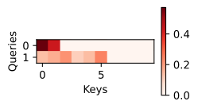

# Chapter 11 Summary

## 11.1. Queries, Keys, and Values

Denote a database of $m$ tuples of *keys* and *values* $\mathcal{D} \stackrel{\textrm{def}}{=} \{(\mathbf{k}_1, \mathbf{v}_1) \ldots (\mathbf{k}_m, \mathbf{v}_m)\}$. Moreover, denote a *query* \mathbf{q}$. Then, we can define the *attention* over $\mathcal{D}$ as

$$
    \textrm{Attention}(\mathbf{q}, \mathcal{D}) \stackrel{\textrm{def}}{=} \sum_{i=1}^m \alpha(\mathbf{q}, \mathbf{k}_i) \mathbf{v}_i
$$

where $\alpha(\mathbf{q}, \mathbf{k}_i) \in \mathbb{R}$ ($i = 1, \ldots, m$) are scalar attention weights. The operation itself is typically referred to as *attention pooling*. The attention over $\mathcal{D}$ generates a linear combination of values contained in the database.

1. The weights $\alpha(\mathbf{q}, \mathbf{k}_i)$ are nonnegative. 

   Then, the output of the attention mechanism is contained in the convex cone spanned by the values $\mathbf{v}_i$.

1. The weights $\alpha(\mathbf{q}, \mathbf{k}_i)$ form a convex combination, i.e., $\sum_i \alpha(\mathbf{q}, \mathbf{k}_i) = 1$ and $\alpha(\mathbf{q}, \mathbf{k}_i) \geq 0$ for all $i$.

   This is the most common setting in deep learning.

1. Exactly one of the weights $\alpha(\mathbf{q}, \mathbf{k}_i)$ is $1$, while all others are $0$.

    This is akin to a traditional database query.

1. All weights are equal, i.e., $\alpha(\mathbf{q}, \mathbf{k}_i) = \frac{1}{m}$ for all $i$.

   This amounts to averaging across the entire database, also called average pooling in deep learning. 

A common strategy for ensuring that the weights sum up to $1$ is to normalize them.

$$
    \alpha(\mathbf{q}, \mathbf{k}_i) = \frac{\alpha(\mathbf{q}, \mathbf{k}_i)}{{\sum_j} \alpha(\mathbf{q}, \mathbf{k}_j)}
$$

To ensure that the weights are also nonnegative, we can use a softmax operation.

$$
    \alpha(\mathbf{q}, \mathbf{k}_i) = \frac{\exp(a(\mathbf{q}, \mathbf{k}_i))}{\sum_j \exp(a(\mathbf{q}, \mathbf{k}_j))}
$$


## 11.3. Attention Scoring Functions


### 11.3.1. Dot Product Attention

With Gaussian kernels, $a$ is as follows.

$$
    a(\mathbf{q}, \mathbf{k}_i) = -\frac{1}{2} \|\mathbf{q} - \mathbf{k}_i\|^2  = \mathbf{q}^\top \mathbf{k}_i -\frac{1}{2} \|\mathbf{k}_i\|^2  -\frac{1}{2} \|\mathbf{q}\|^2.
$$

To simplify the computation, we calculate $a$ as follows.

$$
    a(\mathbf{q}, \mathbf{k}_i) = \mathbf{q}^\top \mathbf{k}_i / \sqrt{d}
$$

Where query $\mathbf{q} \in \mathbb{R}^d$ and the key $\mathbf{k}_i \in \mathbb{R}^d$.

We normalize $a$ with softmax operation, resulting in $\alpha$.

$$
    \alpha(\mathbf{q}, \mathbf{k}_i) = \mathrm{softmax}(a(\mathbf{q}, \mathbf{k}_i)) = \frac{\exp(\mathbf{q}^\top \mathbf{k}_i / \sqrt{d})}{\sum_{j=1} \exp(\mathbf{q}^\top \mathbf{k}_j / \sqrt{d})}
$$

As it turns out, all popular attention mechanisms use the softmax, hence we will limit ourselves to that in the remainder of this chapter.

### 11.3.2. Convenience Functions

#### 11.3.2.1. Masked Softmax Operation

We use the attention mechanism on sequence models. Hence, we need to be able to deal with sequences of different lengths. If such sequences end up in the same minibatch, we need to pad shorter sequences with dummy tokens without a meaning. For instance, assume that we have the following three sentences:

```[text]
Dive  into  Deep    Learning 
Learn to    code    <blank>
Hello world <blank> <blank>
```

Since we do not want blanks in our attention model we simply need to limit $\sum_{i=1}^n \alpha(\mathbf{q}, \mathbf{k}_i) \mathbf{v}_i$ to $\sum_{i=1}^l \alpha(\mathbf{q}, \mathbf{k}_i) \mathbf{v}_i$ for however long, $l \leq n$, the actual sentence is. Since it is such a common problem, it has a name: the `masked softmax operation`.

Masked softmax operation is implemented by setting the values of $\mathbf{v}_i$, for $i > l$, to zero. Moreover, it sets the attention weights to a large negative number, such as $-10^{6}$, making their contribution to gradients and values vanish in practice.



### 11.3.4. Additive Attention

When queries $\mathbf{q} \in \mathbb{R}^q$ and keys $\mathbf{k} \in \mathbb{R}^k$ are vectors of different dimensions, we can either use a matrix to address the mismatch via $\mathbf{q}^\top \mathbf{M} \mathbf{k}$, or we can use `additive attention`.

Another benefit of additive attention is that the attention is additive, leading to computational savings. Additive attention is computed as follows:

$$
    a(\mathbf q, \mathbf k) = \mathbf w_v^\top \textrm{tanh}(\mathbf W_q\mathbf q + \mathbf W_k \mathbf k) \in \mathbb{R}
$$

where $\mathbf W_q\in\mathbb R^{h\times q}$, $\mathbf W_k\in\mathbb R^{h\times k}$, 
and $\mathbf w_v\in\mathbb R^{h}$ are the learnable parameters. We use softmax to normalize the values.

An equivalent interpretation of additive attention is that the query and key are concatenated
and fed into an MLP with a single hidden layer.
