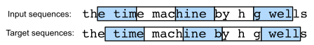

# Chapter 9 Summary

Recurrent neural networks (RNNs) are deep learning models that capture the dynamics of sequences via recurrent connections, which can be thought of as cycles in the network of nodes.

RNNs can be thought of as feedforward neural networks where each layer’s parameters (both conventional and recurrent) are shared across time steps.

## 9.1. Working with Sequences

Now, the inputs are an ordered list of feature vectors $\mathbf{x}_1, \dots, \mathbf{x}_T$, where each feature vector $\mathbf{x}_t$ is indexed by a time step $t \in \mathbb{Z}^+$ lying in $\mathbb{R}^d$.

These cases are possible when working with sequences:

1. sequentially structured input, fixed target
1. fixed input, sequentially structured target
1. sequentially structured input, sequentially structured target
    1. aligned: the input at each time step aligns with a corresponding target (e.g., part of speech tagging)
    1. unaligned: the input and target do not necessarily exhibit a step-for-step correspondence (e.g., machine translation).

### 9.1.1. Autoregressive Models

We are interested in knowing the probability distribution

$$
    P(x_t \mid x_{t-1}, \ldots, x_1)
$$

Or some statistic(s) of this distribution. e.g., the mean.

$$
    \mathbb{E}[(x_t \mid x_{t-1}, \ldots, x_1)]
$$

Such models that regress the value of a signal on the previous values of that same signal are naturally called `autoregressive models`.

There is one major problem: the number of inputs, $x_{t-1}, \ldots, x_1$ varies depending on $t$. There are a few strategies to resolve the issue.

1. Content ourselves to condition on some window of length $\tau$ and only use $x_{t-1}, \ldots, x_{t-\tau}$ observations.

    Now, the number of arguments is always the same, at least for $t > \tau$. Thus, we can use any linear model or deep network that requires fixed-length vectors as inputs.

1. Develop models that maintain some summary $h_t$ of the past observations and at the same time update $h_t$ in addition to the prediction $\hat{x}_t$.

    Now, the models must estimate not only $x_t$ with $\hat{x}_t = P(x_t \mid h_{t})$ but also updates of the form $h_t = g(h_{t-1}, x_{t-1})$. Since $h_t$ is never observed, these models are called `latent autoregressive models`.

To construct training data from historical data, one typically creates examples by sampling windows randomly.

In general, we do not expect time to stand still. However, we often assume that the dynamics, from which each subsequent observation is generated, do not change. Statisticians call dynamics that do not change `stationary`.

### 9.1.2. Sequence Models

Sometimes, especially when working with language, we wish to estimate the joint probability of an entire sequence.

$$
    P(x_1, \ldots, x_T) = P(x_1)
$$

The field of sequence modeling has been driven so much by natural language processing, that we often describe sequence models as "language models",
even when dealing with non-language data.

Language modeling gives us not only the capacity to `evaluate` likelihood, but also the ability to `sample` sequences, and even to optimize for the most likely sequences.

We can reduce language modeling to autoregressive prediction by decomposing the joint density  of a sequence $p(x_1, \ldots, x_T)$ into the product of conditional densities in a left-to-right fashion by applying the chain rule of probability:

$$
    P(x_1, \ldots, x_T) = P(x_1) \prod_{t=2}^T P(x_t \mid x_{t-1}, \ldots, x_1)
$$

Note that if we are working with discrete signals such as words, then the autoregressive model must be a probabilistic classifier, outputting a full probability distribution over the vocabulary for whatever word will come next, given the leftwards context.

#### 9.1.2.1. Markov Models

For this model, we only use $\tau$ previous time steps, i.e., $x_{t-1}, \ldots, x_{t-\tau}$, rather than the entire sequence history $x_{t-1}, \ldots, x_1$.

If we only need $\tau$ steps for the prediction, we say that the sequence satisfies a `Markov condition`.

When $\tau = 1$, we say that the data is characterized by a first-order Markov model. When $\tau = k$, we say that the data is characterized
by a $k^{\textrm{th}}$-order Markov model.

When $\tau = 1$, following holds.

$$P(x_1, \ldots, x_T) = P(x_1) \prod_{t=2}^T P(x_t \mid x_{t-1}).$$

We often assume the Markov condition for simplicity. Even today's massive RNN- and Transformer-based language models seldom incorporate more than thousands of words of context.

With discrete data, we simply count the number of times
that each word has occurred in each context, producing
the relative frequency estimate of $P(x_t \mid x_{t-1})$.

#### 9.1.2.2 The Order of Decoding

We don't need to factorize the sequence $P(x_1, \ldots, x_T)$ left-to-right. In principle, there is nothing wrong with unfolding $P(x_1, \ldots, x_T)$ in reverse order. e.g.,

$$
    P(x_1, \ldots, x_T) = P(x_T) \prod_{t=T-1}^1 P(x_t \mid x_{t+1}, \ldots, x_T)
$$

However, there are many reasons to factorize text in the same direction in which we read it (left-to-right for most languages, but right-to-left for Arabic and Hebrew).

1. It is more natural.

   In everyday life, we observe a sequence and predict what comes next.

1. We can assign probabilities to arbitrarily long sequences using the same language model.

    Extending the probability over steps $1$ through $t$ into $1$ through $t+1$ is simple:
    $$
        P(x_{t+1}, \ldots, x_1) = P(x_{t}, \ldots, x_1) \cdot P(x_{t+1} \mid x_{t}, \ldots, x_1)
    $$

1. Predicting adjacent words is easier than predicting words at arbitrary other locations.

    This is true for all kinds of data. e.g., when the data is causally structured.

### 9.1.4. Prediction

For an observed sequence $x_1, \ldots, x_t$, predicting the output $\hat{x}_{t+k}$ at time step $t+k$ is called the $k$*-step-ahead prediction*.

As $k$ increases, errors accumulate and the quality of the prediction degrades, often dramatically.

## 9.2. Converting Raw Text into Sequence Data

We often use text data represented as sequences of words. Typical preprocessing pipelines execute the following steps:

1. Split the strings into tokens (e.g., words or characters).

1. Build a vocabulary dictionary to associate each vocabulary element with a numerical index.

1. Convert the text into sequences of numerical indices.

### 9.2.2. Tokenization

Tokens are the atomic (indivisible) units of text. Each time step corresponds to 1 token.

Dividing words into tokens is a design choice. For example, we can use every word as a token(large vocabulary), or we can use each character as a token(small vocabulary).

### 9.2.3. Vocabulary

The inputs to the models must be numerical.

Thus, we need to construct a `vocabulary`. i.e., objects that associate each distinct token value with a unique index.

1. We determine the set of unique tokens in our training `corpus`.

1. We assign a numerical index to each unique token

    Rare vocabulary elements are often dropped. Whenever we encounter a token not in the vocabulary(at training or test time), we represent it by a special `<unk>` token, signifying that this is an unknown value.

## 9.3. Language Models

We can map text sequences into tokens. The tokens in a text sequence of length $T$ are in turn $x_1, x_2, \ldots, x_T$. `language model` estimates the joint probability:

$$
    P(x_1, x_2, \ldots, x_T)
$$

### 9.3.1. Learning Language Models

We can model the probability of a sequence of tokens as follows.

$$
    P(x_1, x_2, \ldots, x_T) = \prod_{t=1}^T P(x_t  \mid  x_1, \ldots, x_{t-1})
$$

#### 9.3.1.1. Markov Models and $n$-grams

We can apply Markov models to language modeling by assuming that the probability of a word only depends on the previous $n-1$ words.

$$
    \begin{aligned}
    P(x_1, x_2, x_3, x_4) &=  P(x_1) P(x_2) P(x_3) P(x_4),\\
    P(x_1, x_2, x_3, x_4) &=  P(x_1) P(x_2  \mid  x_1) P(x_3  \mid  x_2) P(x_4  \mid  x_3),\\
    P(x_1, x_2, x_3, x_4) &=  P(x_1) P(x_2  \mid  x_1) P(x_3  \mid  x_1, x_2) P(x_4  \mid  x_2, x_3).
    \end{aligned}
$$

The above are examples of unigram($n=1$), bigram($n=2$), and trigram($n=3$) models, respectively.

#### 9.3.1.2. Word Frequency

We can estimate the probability of words by counting numbers in a text corpus. e.g.,

$$
    \hat{P}(\textrm{learning} \mid \textrm{deep}) = \frac{n(\textrm{deep, learning})}{n(\textrm{deep})}
$$

where $n(x)$ and $n(x, x')$ are the number of occurrences of singletons and consecutive word pairs, respectively.

However, for some unusual word combinations, it is tricky to find enough occurrences to get accurate estimates(especially in three-word or longer combinations). Thus, we need a solution to assign such word combinations a nonzero count.

#### 9.3.1.3. Laplace Smoothing

A common solution to the above problem is to perform some form of `Laplace smoothing`. i.e., add a small constant to all counts.

$n$ is the total number of words in the training set and $m$ is the number of unique words.

$$
    \begin{aligned}
        \hat{P}(x) & = \frac{n(x) + \epsilon_1/m}{n + \epsilon_1}, \\
        \hat{P}(x' \mid x) & = \frac{n(x, x') + \epsilon_2 \hat{P}(x')}{n(x) + \epsilon_2}, \\
        \hat{P}(x'' \mid x,x') & = \frac{n(x, x',x'') + \epsilon_3 \hat{P}(x'')}{n(x, x') + \epsilon_3}
    \end{aligned}
$$

where $\epsilon_1,\epsilon_2$, and $\epsilon_3$ are hyperparameters that control how much smoothing will be applied(larger means more smoothing).

However, Laplace smoothing has a few drawbacks.

1. Many $n$-grams occur very rarely.

    Thus, Laplace smoothing is rather unsuitable for language modeling.

1. We need to store all counts.

1. The meaning of the words is ignored.

   For instance, “cat” and “feline” should occur in related contexts. We cannot adjust such models(word frequency + Laplace smoothing) to additional contexts.

1. Long word sequences are almost certain to be novel.

    Hence, it is insufficient to simply count the frequency of previously seen word sequences.

We will use deep learning to address these drawbacks.

### 9.3.2. Perplexity

We can measure the quality of a language model by its `perplexity`. The concept of perplexity originates from information theory.

Given a sentence, a language model can assign a probability of the likeliness of the sentence to occur.

$$
    \textrm{perplexity}(x_1 \ldots, x_t)
    = P(x_1, \ldots, x_T)^{-\frac{1}{T}}
$$

$\sqrt{T}$ is to compensate for longer sentences having lower probability.

Perplexity can also be written as follows.

$$
    \textrm{perplexity}(x_1 \ldots, x_t) =
    \exp\left(-\frac{1}{n} \sum_{t=1}^n \log P(x_t \mid x_{t-1}, \ldots, x_1)\right)
$$

Thus, perplexity can be understood as the geometric mean of the probabilities of each token.

Let me assume a correct sentence(in the test set). The lower the perplexity, the higher the probability assigned by the model, thus, the better the model. To be more specific, the following holds.

1. Best case: the model always perfectly estimates the probability of the target token as 1.

   The perplexity of the model is 1.

2. Worst case: the model always predicts the probability of the target token as 0.

   The perplexity is positive infinity

3. Baseline: the model predicts a uniform distribution over all the available tokens of the vocabulary.

   The perplexity equals the number of unique tokens of the vocabulary.
    $$
        \begin{aligned}
        &\textrm{perplexity}(x_1 \ldots, x_t)\\
        &= \exp\left(-\frac{1}{n} \sum_{t=1}^n \log P(x_t \mid x_{t-1}, \ldots, x_1)\right)\\
        &= \exp\left(-\frac{1}{n} \sum_{t=1}^n \log \frac{1}{|V|}\right)\\
        &= \exp\left(\log |V|\right)\\
        &= |V|
        \end{aligned}
    $$

    This provides a nontrivial upper bound that any useful model must beat.

### 9.3.3. Partitioning Sequences

We can partition the original sequence into subsequences to obtain more training examples. Let us denote a single input sequence $\mathbf{x}$, starting from token $x_t$ at time step $t$, as follows.
$$
    \mathbf x_t = [x_t, \ldots, x_{t+n-1}]
$$

Then, we can obtain $m$ partitioned subsequences $\mathbf x_d, \mathbf x_{d+n}, \ldots, \mathbf x_{d+n(m-1)}.$

For language modeling,
the goal is to predict the next token based on the tokens we have seen so far; hence the targets (labels) are the original sequence, shifted by one token.
The target sequence for any input sequence $\mathbf x_t$
is $\mathbf x_{t+1}$ with length $n$.

